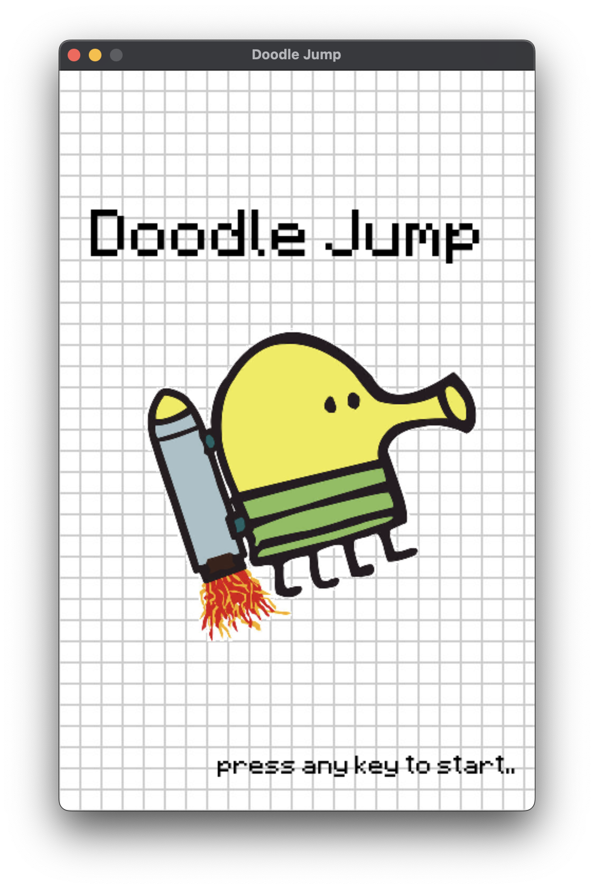
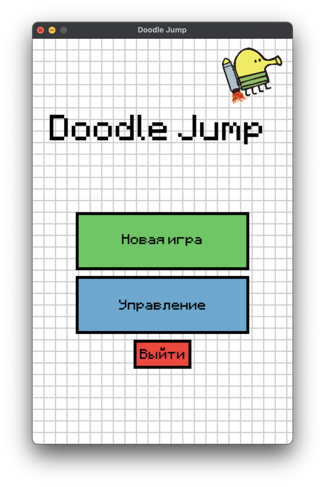
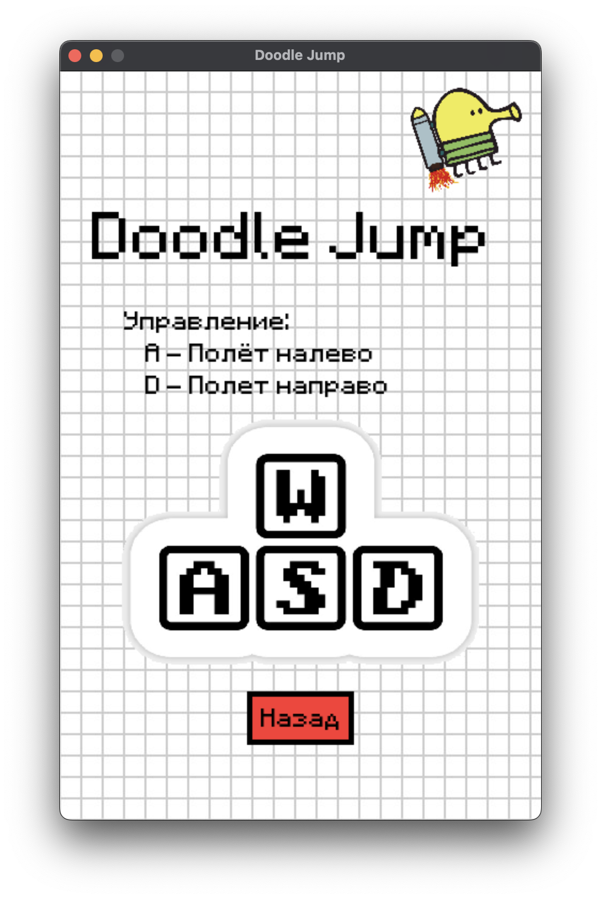

# Doodle Jump Clone (PyGame)

<div align="center">
  
  
  
  
</div>


Клон классической игры Doodle Jump на Python.

## Ключевые технологии и архитектурные решения

### Использованные библиотеки
| Библиотека | Назначение | Особенности реализации |
|------------|------------|-------------------------|
| **PyGame** | Основной игровой движок | Полностью кастомный рендеринг спрайтов, оптимизированная система коллизий |
| **PyGame.mixer** | Управление звуком | Реализована система приоритетов звуковых эффектов |
| **Random** | Генерация уровней | Алгоритм гарантирует проходимость уровня |
| **Sys** | Управление приложением | Грамотная обработка выхода из игры |

## 🔧 Технологический стек

### 📚 Основные библиотеки
- **PyGame 2.6.1** - ядро игры и рендеринг
- **PyGame.mixer** - система звуковых эффектов
- **Random** - интеллектуальная генерация платформ

### 🎮 Особенности реализации
- Модульная архитектура с системой состояний
- Оптимизированный физический движок (60+ FPS)
- Адаптивный интерфейс под разные разрешения
- Система сохранения рекордов

## 🚀 Быстрый старт

```bash
# Клонирование репозитория
git clone https://github.com/m00n33r/DoodleJump_PyGame.git

# Установка зависимостей
pip install -r requirements.txt

# Запуск игры
python3 app.py
